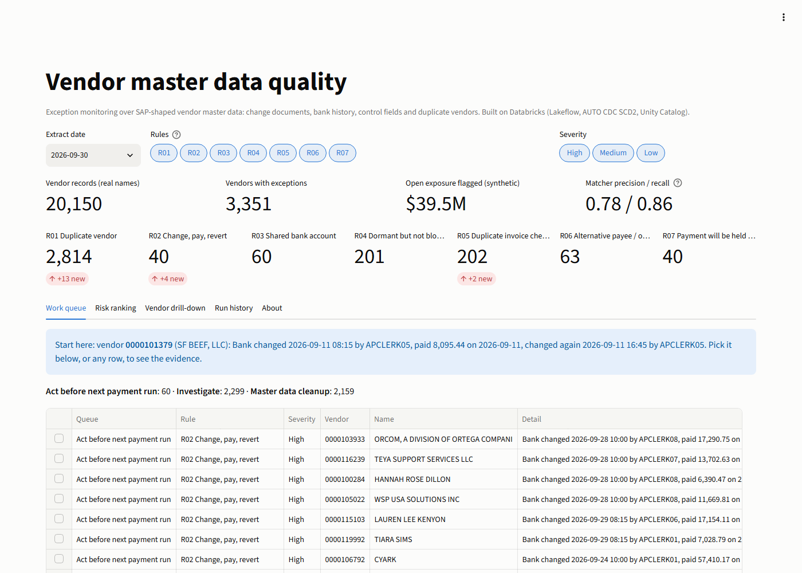

# Vendor master data quality pipeline

[](https://github.com/pratri/vendor-master-quality/actions/workflows/ci.yml)

Duplicate vendors and last-minute bank changes cost AP teams money. This pipeline does exception
monitoring over SAP vendor master data on Databricks.

| Vendor records (real names) | Duplicate matcher precision / recall | Open exposure flagged |
|---|---|---|
| **20,150** | **0.78 / 0.86** (held-out pairs, score threshold 91 of 100) | **$39.5M** (synthetic ledger, last extract date) |

**Highlights**

- **Ground truth for every rule.** A seeded generator injects control exceptions and look-alike decoys.
  On the last date, the pipeline's hits for R02 to R07 match the injected cases exactly: no misses, no
  extras, no decoys, and every case first flagged on the expected day.
- **Proven idempotent.** Rerunning a date, and rebuilding every table from the raw files, both leave all
  output tables identical (row count plus hash). Replaying 30 dates as one update gives the same hashes
  as one update per date.
- **Change documents catch what snapshots miss.** A bank switched at 08:15, paid at the noon payment
  run and switched back at 16:45 is invisible in the end-of-day snapshot. CDHDR/CDPOS feed an SCD type 2
  bank history (AUTO CDC) that shows it.
- **An honest matcher evaluation.** rapidfuzz is compared with Splink 5 and tuned on dev pairs only.
  The evaluation shows the UEI answer key under-counts duplicates, checked with 100 hard-case labels,
  disclosed as AI-labeled.



**Live demo:** [vendor-master-quality.streamlit.app](https://vendor-master-quality-afvmiyhfyy4yhg32upadql.streamlit.app/) ·
**Evaluation:** [docs/evaluation.md](docs/evaluation.md)

**Architecture:** daily SAP extracts → bronze → silver → SCD2 change history → rules and matcher → gold → Streamlit demo and AI/BI dashboard

> Vendor names and addresses are real public data from USAspending.gov. All transactional data is synthetic, shaped to SAP DDIC table and field names, and was not extracted from a live system.

Built on Databricks Free Edition (Lakeflow Declarative Pipelines, AUTO CDC, Unity Catalog, Asset
Bundles, serverless jobs). Nothing is cloud-specific. On Azure Databricks the same bundle deploys
unchanged, with Unity Catalog storage on ADLS Gen2.

### Run the demo (committed data, no Databricks needed)

```powershell
py -3.11 -m venv .venv; .\.venv\Scripts\pip install -e ".[dev,app]"
.\.venv\Scripts\streamlit run app/streamlit_app.py
```

### Rebuild everything on Databricks

```powershell
databricks auth login --host <your-workspace-url>
databricks bundle deploy
python -m generator --upload                  # 30 days of seeded SAP extracts
python -m matching --upload                   # duplicate candidates
databricks bundle run replay --params "single_update=true"
databricks bundle run reconcile               # rules vs. the generator's manifest
databricks bundle run idempotency_check       # rerun a date + full rebuild, compare every table
databricks bundle run export_demo             # gold -> Parquet for the demo
```

---

## What it checks

| Rule | Checks | SAP fields read | Severity |
|---|---|---|---|
| R01 Duplicate vendor | Matcher pair at or above threshold, both vendors active with open items or a payment in the last 90 days | matcher output; LFA1-LOEVM, SPERR | Medium |
| R02 Change, pay, revert | A bank change, a second change within 7 days, and a clearing payment dated between them | CDHDR/CDPOS on LFBK; ACDOCA BLART KZ | High |
| R03 Shared bank account | Same BANKS + BANKL + BANKN on more than one vendor; High when one holder is an employee vendor | LFBK; LFB1-PERNR | Medium / High |
| R04 Dormant but not blocked | No postings for 18 months or more, and none of SPERR, SPERZ, LOEVM set (SPERM alone does not count) | ACDOCA; LFA1-SPERR, SPERZ, LOEVM | Low |
| R05 Duplicate invoice check off | LFB1-REPRF blank | LFB1-REPRF | Medium |
| R06 Alternative payee / one-time vendor | LNRZA or LNRZB set, XZEMP set, or a one-time account paid twice or more in 90 days | LFA1-LNRZA, XZEMP, XCPDK; LFB1-LNRZB; ACDOCA KZ | Medium |
| R07 Payment will be held | Unconfirmed sensitive change (CONFS) with items due by extract date + 7 days. F110 holds these payments, so the job is to confirm or reject the change. | LFA1/LFB1-CONFS; ACDOCA NETDT, AUGBL | Medium |

**Priority score.** `exposure` = sum of absolute open item amounts (ACDOCA HSL, AUGBL blank) for the
vendor. The score is exposure × the highest severity tier among its exceptions (High 3, Medium 2,
Low 1), with no other weights. R01 dominates by volume, because the dataset holds about 2,900 real
duplicate pairs, and dormant vendors have no exposure. So the demo opens on a **work queue**:

1. **Act before the next payment run:** R02, and shared accounts linked to an employee.
2. **Investigate:** R07, other shared accounts, R06, and duplicate pairs scoring 95 or more.
3. **Master data cleanup:** everything else.

## Architecture

```
generator (local, seeded) -> landing volume: staging/ --replay job--> inbox/
  Lakeflow pipeline (serverless, deployed by the bundle)
    bronze_*   11 streaming tables, Auto Loader, exactly-once per file
    silver_*   8 materialized views, 28 expectations (fail on keys, drop unusable rows, warn)
    dim_vendor_bank_scd2, dim_vendor_controls_scd2   AUTO CDC from CDHDR/CDPOS, SCD type 2
    rule_r01..r07 views -> gold_exceptions, gold_vendor_risk, gold_run_history,
                           gold_duplicate_candidates (rapidfuzz matcher output)
  jobs: replay, reconcile, idempotency_check, export_demo
  AI/BI dashboard (bundle)      Streamlit demo (DuckDB over exported Parquet)
```

The workspace setup is all in `databricks.yml`: schema, volume, pipeline, jobs and dashboard. The
workspace itself comes from your CLI profile.

**SAP model.** The target is SAP ECC 6.0 and S/4HANA (on-premise and private cloud). "Vendor" is used
throughout; S/4HANA calls it "supplier". The Business Partner is where data is maintained, and CVI keeps
the vendor tables in step. The model covers:

- **Vendor side:** LFA1, LFB1, LFBK.
- **Business Partner side:** BUT000, BUT0BK (with validity dates), DFKKBPTAXNUM.
- **Link and address:** CVI_VEND_LINK, ADRC.
- **Journal:** ACDOCA, filtered to the leading ledger 0L and KOART K.
- **Change documents:** CDHDR/CDPOS (object class KRED).

## Design decisions

- **Idempotency in three layers.**
  1. Auto Loader ingests each file once.
  2. Silver and gold are materialized views, recomputed from bronze. The one outside input is the matcher
     output file; after replacing it, run a pipeline update so gold picks it up.
  3. AUTO CDC orders changes by change time and CHANGENR, not arrival order.
- **Bank history respects validity.** A BUT0BK row with a future BK_VALID_FROM reaches LFBK only when
  CVI moves it, so the history never applies it early.
- **ACDOCA arrives as a daily delta.** Each day brings its new lines plus earlier lines cleared that day.
  Silver keeps each line's first-cleared date, so open items can be rebuilt as of any extract date.
  Gold only uses postings already delivered by that date.
- **Expectations follow a written policy.** Fail on broken keys, drop rows no rule can use, warn on the
  rest. The generator plants six kinds of defects so this is visible in the event log.

## Duplicate matching

- **Blocking:** state + ZIP3, then first name token. Keeps 99.4% of true pairs in 895,000 candidates out
  of 203 million possible.
- **rapidfuzz WRatio + address, chosen:** precision 0.78, recall 0.86, F1 0.82 on held-out pairs.
- **Comparisons:** the `token_set_ratio` baseline scores 0.69 / 0.88 / 0.78, and unsupervised Splink 5
  scores 0.89 / 0.54 / 0.67.
- **Label noise:** 92% of false positives are identical names under different UEIs. Hand labels on hard
  pairs confirm most are real duplicates, so strict precision is a floor.

Details are in [docs/evaluation.md](docs/evaluation.md).

## Context

Related tools: SAP MDG, Marlin Duplicate Check, Trustpair, Eftsure, apexanalytix.

This complements SAP's native controls: sensitive fields with dual control (T055F, confirmation with
FK08/FK09 and the CONFS status), change documents, and the vendor change display. **S/4HANA Public Cloud**
does not allow table access, so a version for it would read released CDS views such as I_Supplier and
I_SupplierCompany.

## Limitations

- **Synthetic transactions.** All transactional data is synthetic. Rule reconciliation proves the
  pipeline logic against injected cases, not detection on real data. The only accuracy claim is for
  duplicate matching on real names.
- **Real SAP data needs more.** Each item below is noted with its fix in the code review:
  - **Document types.** Invoices and payments are identified by BLART KR and KZ. Real AP also has RE,
    KG, ZP and reversals, so real data should identify them by posting key and clearing instead.
  - **Bank history** assumes one bank account per vendor. Key it on the account for multi-account vendors.
  - **Clearing** is treated as permanent. A clearing reset (FBRA) would need the latest AUGBL as of each
    date.
  - **Exposure** sums absolute open amounts in company-code currency, per the spec. Net partial payments
    and credit memos, and convert currencies.
  - **R04** reads LFA1 blocks only. Add LFB1-SPERR and ZAHLS, and open purchase orders.
- **One-shot ingestion.** Auto Loader ingests each file once, so a corrected re-delivery of a day needs a
  full refresh (about 5 minutes here).
- **SAP modeling assumptions**, each marked in the code:
  - BP change documents use object class BUPA_BUP.
  - ACDOCA offset lines also carry LIFNR.
  - EIN goes in STCD2 and BP tax type US2.
  - CVI moves time-dependent BP banks when they become valid.
  - Payment term keys are typical customer configuration.

## What I would change with real system access

- Read CDHDR/CDPOS directly.
- Pull F110 payment run data (REGUH/REGUP), so R02 can check the paid-to bank and the payment time.
- Respect bank validity dates as delivered by the source (BUT0BK), including changes made after the fact.
- Add the rules that reviewers asked for:
  - duplicate or missing tax ID
  - employee-to-vendor matching against HR data (PA0009/PA0006)
  - segregation of duties on sensitive changes
  - actual duplicate invoices (XBLNR + amount).

## Repo layout

```
extract/      USAspending fetch and vendor master build
generator/    seeded synthetic SAP tables, daily extract replay, manifest
pipelines/    Lakeflow pipeline: bronze, silver, SCD2, gold (+ pipeline.yml)
matching/     normalization, blocking, rapidfuzz, Splink, evaluation, hard cases
jobs/         replay, reconcile, idempotency check, demo export (+ job YAML)
dashboards/   AI/BI dashboard deployed by the bundle
app/          Streamlit demo and its exported Parquet data
docs/         evaluation report, labeling guide, platform notes, charts
tests/        pytest (generator, matching, normalization, bundle config); CI runs ruff and pytest
```
