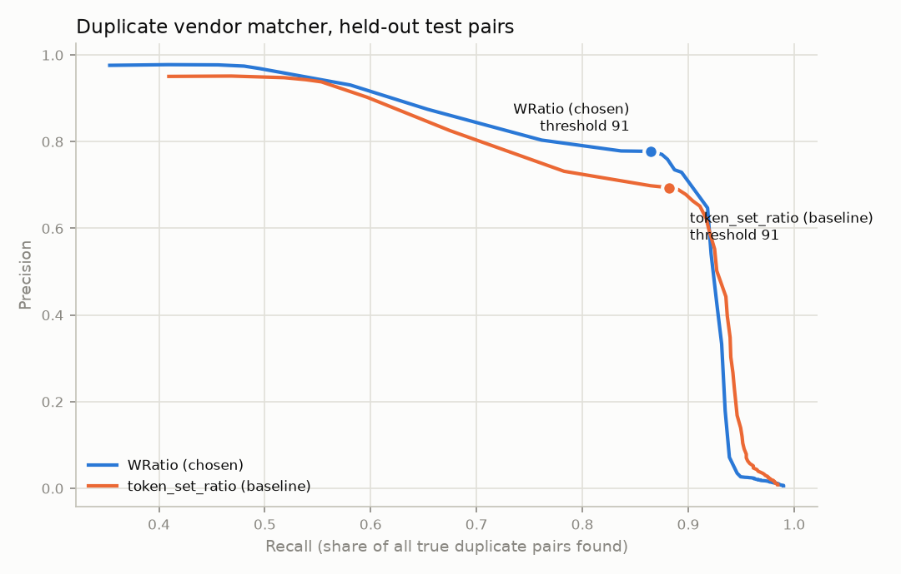

# Duplicate vendor matcher: evaluation

## Setup

- **Population.** Every vendor record from Department of the Interior awards, FY2025 and FY2026
  (USAspending.gov): 20,150 records, one per distinct (UEI, raw name, address). No sampling.
- **What the matcher sees.** The SAP-shaped vendor extract only: ADRC-NAME1 (40 characters, truncated
  as SAP stores it), street or PO box, city, region and ZIP for regular vendors (LFA1-KTOKK KRED).
  It never sees the UEI.
- **UEI answer key.** Two records sharing a UEI are a true duplicate pair (2,945 pairs). Candidate
  pairs with different UEIs and no parent link are negatives. Pairs under the same parent UEI (or
  parent and child) are "related"; they count as neither and are reported apart. Random pairs are
  never sampled, because nearly all of them would be easy non-matches and precision would look better
  than it is.
- **Tuning.** Pairs are split 50/50 by a hash of the pair. The scorer, name weight and threshold are
  chosen on the dev half, and the headline numbers come from the test half. The error samples below
  come from the dev half. One caveat: the idea of trying WRatio came from looking at an early batch of
  test-half errors. The choice itself was made on dev F1.
- **Reproduce.** `python -m matching` writes `data/matching/metrics.json`, the curve data, the error
  samples and the chart. `python -m matching.hard_cases score` scores the hard-case labels.

## Blocking

| Pass | Key | Candidate pairs |
|---|---|---|
| 1 | state + first 3 ZIP digits | 749,281 |
| 2 | first token of normalized name | 154,695 |
| Union (deduplicated) | | **895,497** |

That is 0.44% of the 203 million possible pairs. Blocking keeps **2,927 of 2,945 true pairs (99.4%)**.
The 18 it loses count against recall below.

## Results against the UEI key (test half)

| Method | Threshold | Precision | Recall | F1 |
|---|---|---|---|---|
| **rapidfuzz WRatio name + address (chosen)** | 91 of 100 | **0.778** | **0.865** | **0.819** |
| rapidfuzz token_set_ratio (baseline) | 91 of 100 | 0.694 | 0.882 | 0.777 |
| Splink 5.0.0, unsupervised (DuckDB) | match weight 14.75 | 0.889 | 0.536 | 0.669 |

**rapidfuzz score.** 0.9 × name similarity + 0.1 × address similarity (token_set_ratio), on a 0 to 100
scale. On the dev half the chosen method scored P 0.787, R 0.879, F1 0.830.

**Why WRatio.** `token_set_ratio` scores 100 whenever one name's words are a subset of the other's, so
"RED INC" matches "RED SKY INC". WRatio blends several ratios and penalizes that case. It cut false
positives by 36% at a cost of about 2 points of recall.

**Splink.** A Fellegi-Sunter model on the same blocking keys:
- **Comparisons:** Jaro-Winkler levels on the name, with term-frequency adjustment; Jaro-Winkler on
  the address; exact ZIP. City was dropped because it double-counted location and scored worse on dev.
- **Training:** u from random sampling, and m by expectation maximisation, with no labels.

The first EM run trained on ZIP blocks and learned "same town" instead of "same company" (m for an
exact name match came out at 0.03). Training on identical-address and identical-name blocks fixed that.

Splink reaches the highest precision, but whole-string Jaro-Winkler plus location penalties miss
duplicates that share a name but sit at a different address. That is the most common kind here. WRatio
compares word by word and handles those. rapidfuzz stays the production matcher.

**Related companies.** 915 candidate pairs are same-parent or parent-child, and 199 score above the
threshold. They are excluded from precision, but R01 still flags them. Counted as errors, operational
precision against the UEI key would be about 0.73. The hard-case labels below suggest most of them are
really the same legal entity.

## Labeled hard cases

`data/labels/hard_case_candidates.csv` holds 150 deliberately hard pairs, in four groups:
- identical name under different UEIs (45)
- scores within 6 points of the threshold (45)
- true pairs the matcher missed (35)
- related pairs above the threshold (25).

The file has no UEI column, so the labeler is not anchored by it; the key sits in a separate file. The
labeling rules are in [labeling_guide.md](labeling_guide.md).

**Who labeled.** All 150 pairs were labeled by Claude, an AI assistant, following the guide, without
seeing the key. A person should spot-check them before relying on these numbers.

| Group | duplicate | related | not duplicate | unsure |
|---|---|---|---|---|
| Identical name, different UEI (45) | 43 | 0 | 2 | 0 |
| Near threshold (45) | 10 | 5 | 29 | 1 |
| True pairs the matcher missed (35) | 26 | 2 | 0 | 7 |
| "Related" above threshold (25) | 24 | 0 | 0 | 1 |

What the labels show:

1. **Most "false positives" against the UEI key are real duplicates.** 43 of 45 identical-name,
   different-UEI pairs are the same company registered more than once.
2. **The UEI "related" class hides duplicates too.** 24 of 25 are one legal entity with a registration
   per campus or office, such as the Research Foundation for SUNY or the Regents of a university.
3. **In total, 69 labeled pairs are duplicates the UEI key calls different.** No labeled "not
   duplicate" shares a UEI.

On the 134 pairs with a clear answer (duplicate or not duplicate):

| Method | Precision | Recall | F1 |
|---|---|---|---|
| rapidfuzz WRatio (chosen) | 0.96 | 0.71 | 0.82 |
| rapidfuzz token_set_ratio | 0.95 | 0.74 | 0.83 |
| Splink 5 | 1.00 | 0.13 | 0.22 |

On these hard pairs the two rapidfuzz scorers are within one or two pairs of each other; WRatio stays
the choice because it wins on the full held-out population above.

These pairs are chosen to be hard, so they are not a population estimate. Together with the label
analysis they say that strict precision against the UEI key (0.78) understates the matcher, and that
recall on the hard pairs is the part to improve.

## Error analysis (dev half)

### False positives (scored as duplicates, different UEIs)

| # | Record A | Record B | Why it happened |
|---|---|---|---|
| 1 | LEIDOS, INC., 1750 PRESIDENTS ST | LEIDOS, INC., 1750 PRESIDENTS ST FL 10 | The same company under two UEIs. The key calls it a non-match, but AP would want it flagged. |
| 2 | NORTHWESTERN UNIVERSITY, 633 CLARK ST | same name, same address | The same institution with two registrations. Label noise, not a matcher error. |
| 3 | UNIVERSITY OF SOUTH ALABAMA | UNIVERSITY OF ALABAMA | A genuine error. These are different universities, and one inserted word barely moves WRatio. The addresses on "University Blvd" also look alike. |
| 4 | NATIVE VILLAGE OF NAPAKIAK | NATIVE VILLAGE OF NAPASKIAK | A genuine error: two villages whose names differ by one letter. Needs a rule that one-letter differences in short proper names are not a match. |
| 5 | LINCOLN COUNTY CONSERVATION DISTRICT | LINCOLN CONSERVATION DISTRICT | Different districts with near-identical generic names. The name dominates the score, and the address (10% weight) cannot pull it down. |

### False negatives (true duplicates the matcher missed)

| # | Record A | Record B | Why it happened |
|---|---|---|---|
| 1 | FLUIDIGM CORPORATION | STANDARD BIOTOOLS INC | A company rename at the same address. No name similarity to find. |
| 2 | LINDEBLAD, MARK | TRI-COUNTY SEPTIC & SONS LLC (same address) | A sole proprietor filed once as the owner and once as the business. |
| 3 | PASSAMAQUODDY TRIBE | PLEASANT POINT INDIAN RESERVATION | The tribe and its reservation name. The two strings have nothing in common. |
| 4 | BLOOMBERG INDUSTRY GROUP, INC. | BUREAU OF NATIONAL AFFAIRS, INC., THE (same address) | A rename after an acquisition. |
| 5 | EQUIFAX WORKFORCE SOLUTIONS LLC (GA) | TALX CORPORATION (MO) | A rename plus a move. Blocking never compared them: different state and different first token. |

## What would improve it

1. **Same address, different name.** Add a review queue for these pairs. It catches renames and
   owner-vs-business records (false negatives 1, 2 and 4), which name similarity can't.
2. **Expand abbreviations and reorder inverted names.** Handle state abbreviations and inverted
   government names during normalization.
3. **Treat differing numbers and one-letter changes as mismatches.** This applies to Roman numerals,
   numbered entities and short proper names (false positive 4).
4. **Add tax ID and bank as match signals.** They are the strongest duplicate evidence in SAP (STCD1/STCD2,
   LFBK). They are synthetic here, so they are not used.
5. **Have a person review the hard-case labels.** They were AI-labeled.
